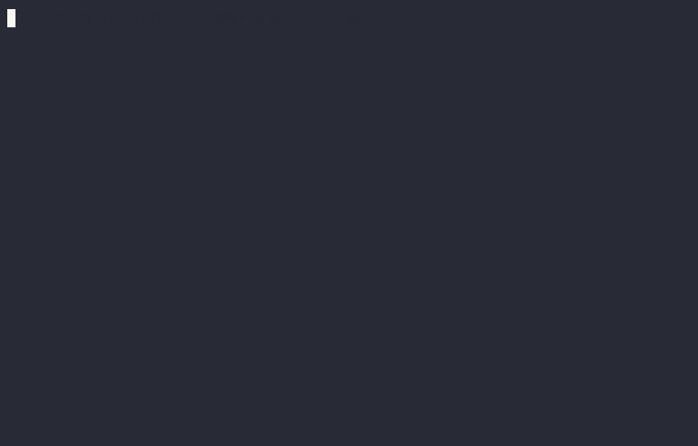

Implementing a tiny autograd framework for training MNIST to >95% across various languages.

- [x] Python (numpy wrapper with barebones autograd)
- [x] C (custom tensors with barebones autograd)
- [x] HTML/CSS/Javascript (just a front-end for python server using websockets)

# Python Demo

# C Demo

# HTML/CSS/JS Demo

